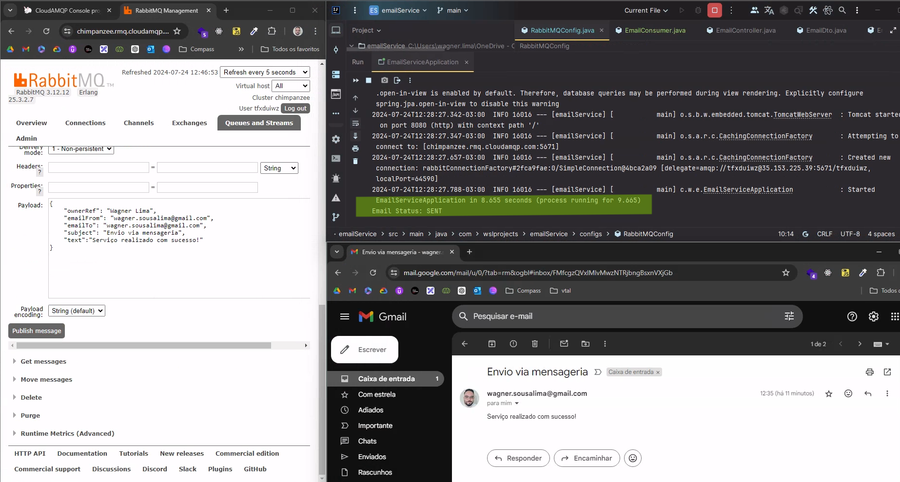

<h1 align="center"> Email Messaging Microservice
 
 

  

</h1>

<h2 align="center"> 💻 Projeto </h2>

  Este projeto é um microserviço de mensageria de email desenvolvido utilizando Java e RabbitMQ.  
O objetivo principal é fornecer uma solução escalável e eficiente para o envio de emails em aplicações distribuídas.

<h2 align="center"> 📑 Funcionalidades </h2>

- Envio assíncrono de emails
- Configuração de filas e exchanges no RabbitMQ
- Integração com serviços de email
- Logs detalhados para monitoramento e depuração

<h2 align="center"> 🔧 Tecnologias Utilizadas </h2>

- Java
- Spring Boot
- RabbitMQ
- Spring AMQP
    

